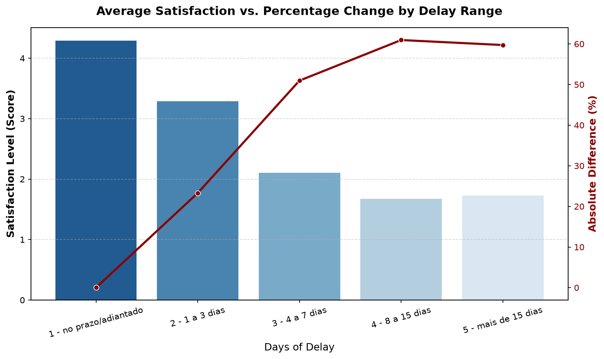
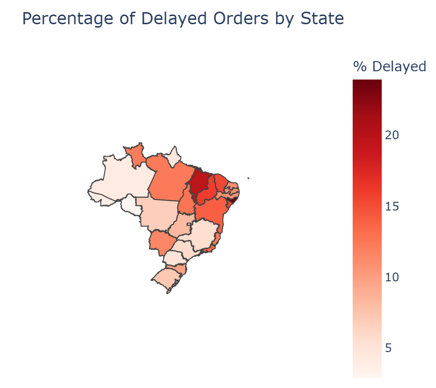
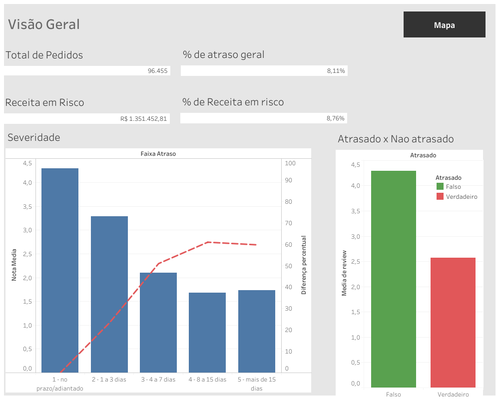
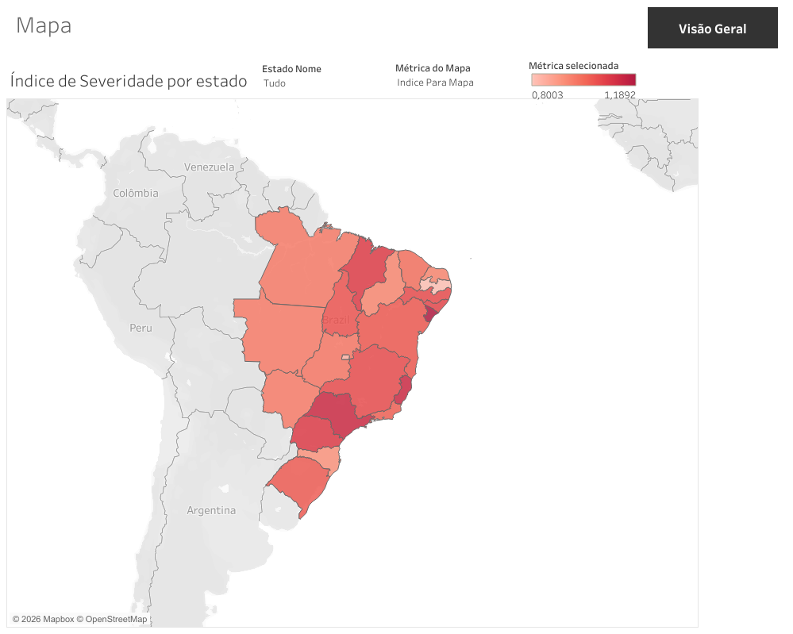

# Olist E-commerce: Delivery Delay Analysis

**Are delivery delays hurting customer satisfaction and putting revenue at risk? Where does it happen most, and what can we do about it?**

Data analytics case study built on the real public dataset of Olist, a Brazilian e-commerce marketplace. Full workflow from raw CSV files to an interactive dashboard, following the Google Data Analytics six-phase framework (Ask, Prepare, Process, Analyze, Share, Act).

**Tools:** Python (Pandas), DuckDB / SQL, Plotly, Matplotlib / Seaborn, Tableau Public

**Interactive dashboard:** [View on Tableau Public](https://public.tableau.com/app/profile/ricardo.borges.almeida.moraes/viz/Projeto_ecommerce_atraso/Painel1)

---

## Data Source and License

- **Dataset:** [Brazilian E-Commerce Public Dataset by Olist](https://www.kaggle.com/datasets/olistbr/brazilian-ecommerce) (Kaggle)
- **Scope:** ~100,000 orders placed between 2016 and 2018 across multiple Brazilian marketplaces
- **Structure:** 9 relational CSV tables (orders, customers, order items, payments, reviews, sellers, products, geolocation, category translation)
- **License:** public dataset released by Olist for analytical and educational use. Source cited throughout.

> The data covers 2016 to 2018. The goal is not to diagnose Olist's current operation, but to show how a business pattern (delays eroding satisfaction and revenue) can be identified and turned into an action recommendation.

---

## Table of Contents

1. [Introduction](#introduction)
2. [Prepare, Process, Analyze](#prepare-process-analyze)
3. [Dashboard](#dashboard)
4. [Recommendations](#recommendations)
5. [Conclusion](#conclusion)
6. [Next Steps](#next-steps)
7. [Technical Details](#technical-details)

---

## Introduction

Olist connects small retailers to Brazil's largest online sales channels. When an order arrives after the promised date, the customer feels it, and that frustration can show up as a low review score and, over time, as lost revenue.

This project takes the point of view of a **Chief Operating Officer**. The financial lens of the CFO is embedded in the recommendations. The central question:

> **Are delivery delays lowering customer satisfaction and exposing revenue to risk, and where should the company act first?**

To answer it I measured four things: whether an order was late (delivered after the estimated date), the review score, the amount paid, and the customer's state.

---

## Prepare, Process, Analyze

### Prepare

The data passed a ROCCC credibility check (Reliable, Original, Comprehensive, Current, Cited). It carries no personal information: only hashed customer IDs, city/state, and aggregated payment values.

| Check | Result |
|---|---|
| Duplicate rows | 0 across the 6 tables used |
| Referential integrity | 0 broken keys (seller and customer joins) |
| Values out of range | 0 (review scores 1 to 5, no negative prices or payments) |
| Main issue found | Date columns stored as text; some delivery dates null |

### Process

| # | Action | Result |
|---|---|---|
| 1 | Removed `delivered` orders with null delivery dates (data inconsistency, not orders in transit) | 23 orders removed |
| 2 | Converted date columns from text to datetime | Applied to orders, order items, reviews |
| 3 | Loaded 6 clean tables into DuckDB | Queried with SQL from Python |

The relational logic (joins, delay flag, geographic segmentation) was done in SQL on DuckDB, with each business query versioned as a `.sql` file. A fan-out bug (orders with more than one review inflating the join) was caught and fixed by aggregating reviews per order before joining.

### Analyze

**Finding 1: Delay drops satisfaction, and it is a national pattern.**
The average review score falls from about **4.3 on on-time orders to about 2.6 on late ones**. Nearly every state follows the same drop, so this is not a regional issue, it is general.



**Finding 2: The damage saturates around 7 days.**
Severity is not linear. The score falls sharply through the first 7 days of delay, then flattens. An order that is already 8 or 15 or 30 days late is roughly equally bad. Most of the harm is done early.

**Finding 3: The delay rate concentrates in specific states.**
While the satisfaction drop is national, the **delay rate** varies a lot by state. It runs well above the national average (about 8%) in Rio de Janeiro (13.5%), Bahia (14.0%), Ceara (15.3%), Maranhao (19.7%), Alagoas (23.9%), Sergipe (15.2%), and Piaui (16.0%), and well below it in Sao Paulo (5.9%), Minas Gerais (5.6%), and Parana (5.0%). All of these have enough volume to trust the number.



**Finding 4: R$ 1.35 million in revenue is exposed to delay.**
Adding up the amount paid on late orders gives **R$ 1,351,452.81, or 8.76% of total revenue**, passing through a poor delivery experience. This is not proven lost revenue, it is revenue exposed to the risk of churn and negative public reviews.

**What the data does not show: the mechanical cause.**
I tested and discarded several explanations for the geographic pattern. Distance did not hold: same state 6.1% delayed versus different state 9.3%, same region 7.6% versus different region 8.9%, differences too small to explain the pattern. Rio de Janeiro sits in the same region as most sellers (in Sao Paulo) and still has one of the highest delay rates. Item count, freight, and order value also failed to explain it. The analysis shows the effect and the where, not the why. That gap is documented honestly rather than forced.

---

## Dashboard

An interactive two-page dashboard built in Tableau Public.

**Overview page:** headline KPIs, the severity curve, and the on-time versus late comparison.



**Geographic page:** a choropleth of Brazil with a parameter to switch the metric (delay rate, revenue at risk, severity index) and a state ranking.



[Open the live dashboard on Tableau Public](https://public.tableau.com/app/profile/ricardo.borges.almeida.moraes/viz/Projeto_ecommerce_atraso/Painel1)

---

## Recommendations

1. **Run a prioritized logistics audit in the seven high-delay states** (RJ, BA, CE, MA, AL, SE, PI), starting with Rio de Janeiro, which combines a high delay rate with high order volume. This targets the problem instead of spreading a generic nationwide effort.

2. **Set a 7-day delay ceiling as the operational target.** Because satisfaction damage saturates around 7 days, the priority is preventing an order from crossing that line, not shortening delays that are already catastrophic. Preventing a 5-day delay from becoming a 10-day delay recovers far more satisfaction than rescuing a 20-day delay to 10 days.

3. **Frame the investment against the R$ 1.35 million at risk.** That figure (8.76% of revenue exposed to a poor delivery experience) is the business case for funding the audit and the fix.

4. **Investigate the cause with data the current dataset lacks.** Since distance, item count, freight, and order value were ruled out, the next hypotheses need carrier-level performance (which carrier runs each route) and seller-level delivery performance.

> **One nuance for the operations team:** delay is measured against Olist's own estimated date, so there are two levers. Fixing the actual logistics is the real solution. Recalibrating the promised date in the problem states is easy but only manages the customer's expectation. The recommendation is the real fix, with recalibration treated as a stopgap.

---

## Conclusion

Delivery delays measurably erode customer satisfaction across Brazil, and about 8.76% of revenue flows through a delayed, dissatisfied experience. The satisfaction damage lands early (within 7 days) and concentrates geographically in seven states. The company knows **where** to act and **how much** is at stake, even though the mechanical **why** needs data beyond this dataset. That is enough to justify a targeted logistics audit with a clear financial rationale.

---

## Next Steps

| Action | Owner | Suggested timeline | Expected impact |
|---|---|---|---|
| Logistics audit in the 7 high-delay states | Operations | Next quarter | Reduce delay rate where it is worst |
| Enforce a 7-day delay ceiling as an operational KPI | Operations | Immediate | Protect satisfaction before it saturates |
| Collect carrier and seller level delivery data | Data / Operations | Next quarter | Isolate the mechanical cause |
| Re-run the analysis with the new data | Data | After collection | Confirm the cause and refine targeting |

---

## Technical Details

**Repository structure**

```
olist-ecommerce-analysis/
├── notebooks/        # main analysis notebook (Python + DuckDB)
├── sql/              # business queries, one .sql file each
├── dashboard/        # Tableau workbook and exported CSVs
├── images/           # charts and dashboard screenshots
├── requirements.txt
└── README.md
```

**Pipeline:** raw CSV files, cleaned in Python/Pandas, loaded into DuckDB, queried with SQL, visualized in Python (Plotly, Matplotlib, Seaborn) and Tableau Public.

**Key numbers:** 96,455 delivered orders analyzed. 8.11% overall delay rate. R$ 1,351,452.81 (8.76% of revenue) exposed to delay. Satisfaction drop from 4.3 to 2.6.

---

*Ricardo Borges. Data Analyst in transition, from Electronic Engineering to Data.*
*[LinkedIn](https://www.linkedin.com/in/ricardobamoraes/) · Dataset: [Olist on Kaggle](https://www.kaggle.com/datasets/olistbr/brazilian-ecommerce)*
